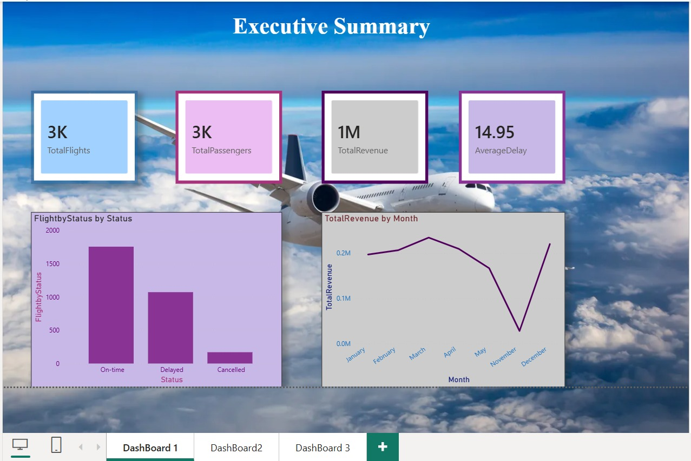
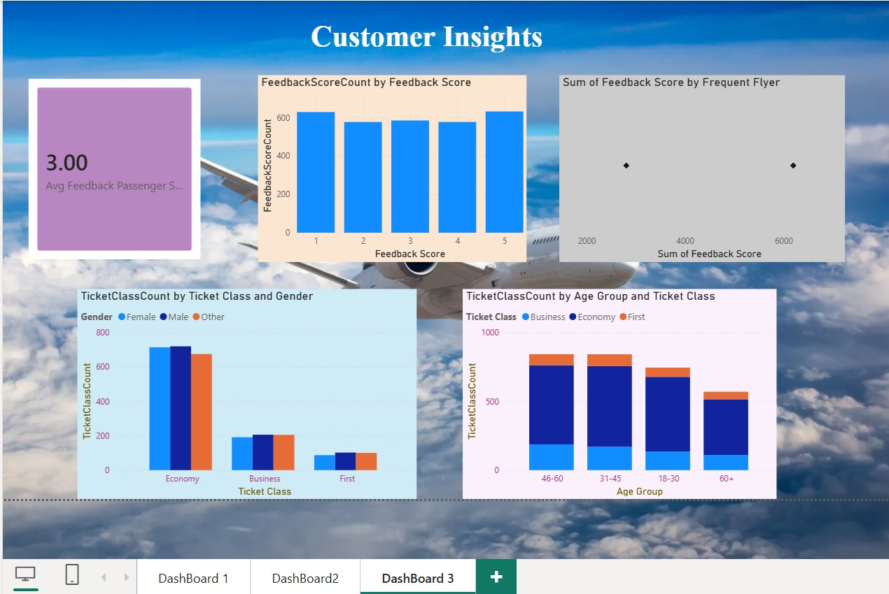

# SkyHigh Airlines – Power BI Dashboard

## Project Overview

This project is an interactive **Power BI dashboard developed as part of a Power BI course project** for analyzing airline performance, flight operations, passenger satisfaction, delays, routes, airports, and revenue trends.

The dashboard is designed to provide business-oriented insights through interactive KPIs and visualizations that can support decision-making and identify areas for operational and customer-service improvements.

---

## Project Objectives

The main objectives of this project are:

- Analyze overall airline performance
- Track flight punctuality and identify delay trends
- Evaluate passenger satisfaction scores
- Understand top-performing routes and airports
- Analyze airline revenue trends
- Provide KPIs to support business decision-making

---

## Tools & Technologies

- **Microsoft Power BI**
- **Power Query**
- **DAX**
- **Microsoft Excel / CSV**
- **Data Cleaning & Transformation**
- **Data Modeling**
- **Data Visualization**

---

## Dataset

The project uses four datasets:

### 1. Airline Flights

`Airline_Flights.csv`

Contains flight-level information such as:

- Flight ID
- Airline
- Source
- Destination
- Departure Time
- Arrival Time
- Flight Status
- Delay
- Aircraft Type
- Date

### 2. Airline Passengers

`Airline_Passengers.csv`

Contains passenger information such as:

- Passenger ID
- Flight ID
- Ticket Class
- Age
- Gender
- Feedback Score
- Check-in Luggage
- Frequent Flyer

### 3. Airline Revenue

`Airline_Revenue.csv`

Contains revenue-related information such as:

- Flight ID
- Ticket Price
- Total Revenue
- Baggage Fee
- Extras

### 4. Airline Airports

`Airline_Airports.csv`

Contains airport information such as:

- Airport Code
- City
- Country
- Region
- On-Time Percentage

Detailed dataset information is available in:

`Documentation/Data_Dictionary.md`

---

# Dashboard Structure

The Power BI report contains three main dashboard sections.

---

## 1 Executive Summary

The Executive Summary provides an overview of airline performance.

### KPIs & Visualizations

- Total Flights
- Total Passengers
- Total Revenue
- Average Delay
- Flights by Status
- Monthly Revenue Trend
- Flight Routes / Route Map

### Dashboard Preview



---

## 2️ Flight Operations

The Flight Operations dashboard focuses on flight punctuality and operational performance.

### Analysis Includes

- Average Delay by Route
- Delay Trend by Month
- Aircraft Type Usage
- Top 5 Delayed Airports

### Dashboard Preview


---

## 3️ Customer Insights

The Customer Insights dashboard focuses on passenger satisfaction and customer behavior.

### Analysis Includes

- Average Passenger Satisfaction / Feedback Score
- Feedback Score Distribution
- Ticket Class Breakdown
- Frequent Flyers vs Satisfaction Score
- Passenger-related insights

### Dashboard Preview



---

#  DAX Measures

The project includes DAX calculations for key business KPIs.

The required calculations include:

- Total Number of Flights
- On-Time Rate
- Average Delay
- Total Revenue
- Average Feedback Rate
- Frequent Flyer Rate

The DAX measures are documented in:

`DAX/Airline_KPI_Measures.txt`

---

#  Data Preparation

The project uses Power BI and Power Query for data preparation and transformation.

The overall workflow includes:

```text
Raw Data
   ↓
Data Import
   ↓
Data Cleaning
   ↓
Data Transformation
   ↓
Data Modeling
   ↓
DAX Measures
   ↓
KPI Development
   ↓
Interactive Visualizations
   ↓
Business Insights
